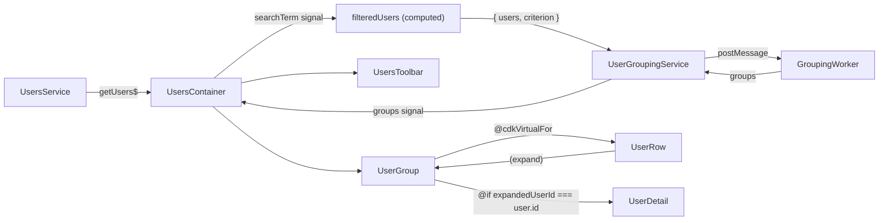

# Awork Users — Performance + Grouping Plan

> **Spec snapshot.** This file is the contract we drove the implementation from. The live working copy lived in `.cursor/plans/awork-users-perf-grouping_*.plan.md` while we iterated. The "Outcome & Deviations" section at the bottom is appended after implementation and reflects what actually shipped.

**Overview:** Refactor the `users` feature to render 5000 users grouped by nationality (criterion is configurable end-to-end) using a Web Worker for grouping, `@angular/cdk` virtual scroll inside collapsible group sections, an in-place expand panel powered by Angular v21's `animate.enter` / `animate.leave`, and client-side search — while fixing the O(N²) per-CD hotspot in the current `UserComponent`.

## Goals & Non-Goals

- **Goals**: 5000 users on screen with smooth scroll/interaction, grouping computed off-main-thread, expand-in-place with animation, client-side search, production-grade tests and docs.
- **Non-goals (per your selection)**: grouping-criterion switcher button, paginated load-more, live deploy. Architecture stays criterion-agnostic so any of these can be added later.

## Performance hotspots in current code (must-fix)

- `nationalitiesCount` getter in [`user.component.ts`](../../../projects/awork-challenge/src/app/users/components/user/user.component.ts) recomputes on every CD pass, scanning all 5000 users via `reduce`. With 5000 rows and OnPush still firing on input changes, this is the dominant cost.
- The `allUsers` input on the row component forces every row to depend on the entire list reference.
- `track $index` in [`users.component.html`](../../../projects/awork-challenge/src/app/users/containers/users/users.component.html) defeats keyed list diffing.
- No virtualization: 5000 DOM rows on a phone are unviable.
- HTTP call has no error handling, no shareReplay, no `isLoading` flag.

## Architecture (data flow)



## Dependencies to add

- `@angular/cdk@^21` runtime (for `CdkVirtualScrollViewport`).

No `ng-mocks` — it's deprecated for this project. Component tests use plain `TestBed` providers with `useValue` stubs (built from `vi.fn()`) and import the real standalone children, mocking only the services those children depend on.

## File map

New / changed files under `projects/awork-challenge/src/app/users/`:

- `models/`
  - `user.model.ts` — **enriched** with `id` (=login.uuid), `gender`, `age`, `dob`, `country`, `city`, `state`, `cell`, `username`, `imageLarge`. Existing fields preserved.
  - `user-group.model.ts` — `{ key: string; label: string; count: number; users: User[] }`.
  - `grouping-request.model.ts`, `grouping-response.model.ts` — typed worker messages with `requestId`.
- `enums/`
  - `grouping-criterion.enum.ts` — `const enum GroupingCriterion { alphabetical, age, nationality, gender }` plus `GroupingCriterionET`.
- `services/`
  - `user/user.service.ts` — extend DTO→domain mapping, add `shareReplay({ bufferSize: 1, refCount: true })` on the response, surface a typed error via `catchError`. Same `apiUrl`/seed semantics.
  - `user-grouping/user-grouping.service.ts` — wraps a single shared `Worker`, exposes `group(users, criterion): Promise<UserGroup[]>`. Falls back to the synchronous pure util when `Worker` is unavailable (Vitest / SSR).
  - `user-grouping/user-grouping.worker.ts` — `self.onmessage` → `groupUsers(...)` → `postMessage`. Pure logic delegated.
- `utils/`
  - `group-users/group-users.util.ts` (+ `.spec.ts`) — pure grouping function shared by worker and fallback. Sorts groups by key, sorts users within group by `lastname,firstname`. Age uses bucketed labels (`<18`, `18-24`, `25-34`, `35-44`, `45-54`, `55-64`, `65+`).
  - `filter-users/filter-users.util.ts` (+ `.spec.ts`) — pure case-insensitive filter on `firstname`, `lastname`, `email`, `username`, `nat`, `country`.
  - `expandable-virtual-scroll-strategy/expandable-virtual-scroll-strategy.ts` (+ `.spec.ts`) — implements `VirtualScrollStrategy`: fixed `itemSize` for collapsed rows, plus a known `expandedItemSize` for the single expanded row pointed to by an input signal. Keeps `CdkVirtualScrollViewport` scrollbar math correct without resorting to `cdk-experimental` autosize.
- `components/` (presentational, OnPush, signal inputs/outputs)
  - `users-toolbar/` — search input (debounced via `toSignal` + `effect`), grouping label.
  - `user-group/` — sticky header (label + count, click toggles `expanded`), `cdk-virtual-scroll-viewport` body using the custom strategy and `*cdkVirtualFor` over the group's users; emits `(userExpand)` upward; renders `<awk-user-detail>` inside the viewport when `expandedUserId() === user.id`, gated with `animate.enter` / `animate.leave`.
  - `user-row/` — replaces existing `user/` (folder rename). No `allUsers` input. Pure binding of one `user` input + `expanded` boolean. Click emits `(toggle)`.
  - `user-detail/` — expanded panel: large image (`NgOptimizedImage`), country + city + state, gender, age + dob, username + email + cell. Hosts the `animate.enter`/`animate.leave` classes.
- `containers/users/users.component.{ts,html,scss,spec.ts}` — rewritten to own state and orchestrate.

Untouched: `users.routes.ts`, app shell.

## Container state shape

Plain signals (StateMixin not required at this complexity, per `state.mixin.ts` guidance):

```ts
users: WritableSignal<User[]> = signal<User[]>([]);
isLoading: WritableSignal<boolean> = signal<boolean>(true);
error: WritableSignal<HttpErrorResponse | null> =
  signal<HttpErrorResponse | null>(null);
searchTerm: WritableSignal<string> = signal<string>('');
criterion: WritableSignal<GroupingCriterionET> =
  signal<GroupingCriterionET>('nationality');
expanded: WritableSignal<{ groupKey: string; userId: string } | null> =
  signal(null);
filteredUsers: Signal<User[]> = computed(() =>
  filterUsers(this.users(), this.searchTerm()),
);
groupsResource = resource({
  request: () => ({ users: this.filteredUsers(), criterion: this.criterion() }),
  loader: ({ request }) =>
    this.userGroupingService.group(request.users, request.criterion),
});
```

`resource()` (Angular v21) gives us `groupsResource.value()`, `.isLoading()`, `.error()` for free, scoped to grouping recomputations.

## Web Worker wiring (esbuild builder)

Standard pattern supported by `@angular/build:application`:

```ts
#worker = typeof Worker !== 'undefined'
  ? new Worker(new URL('./user-grouping.worker', import.meta.url), { type: 'module' })
  : null;
```

Worker file: pure, no Angular imports, ESM, just `self.onmessage`.

`tsconfig.app.json` already targets ESM; no extra build config needed beyond confirming the worker file is picked up by esbuild.

## Expand-in-place animation

Per [Angular v21 enter/leave animations docs](https://angular.dev/guide/animations):

```html
@if (expandedUserId() === user.id) {
<awk-user-detail
  [user]="user"
  animate.enter="user-detail-enter"
  animate.leave="user-detail-leave"
/>
}
```

CSS keyframes in `user-detail.component.scss` for slide+fade open/close. Only one detail rendered per group at a time → bounded DOM cost.

## Default rendering of search + criterion choice

Default criterion: `nationality` (matches the original visual hint of grouping nationalities). The criterion is centralized in one place; swapping it to `alphabetical` / `age` / `gender` is a one-liner if a switcher is later added.

Search is debounced (~150ms) to avoid spamming the worker on every keystroke; filtering is on the main thread (sub-millisecond at 5000 entries) and only the filtered slice is shipped to the worker.

## Performance checklist applied

- `track user.id` everywhere (id = `login.uuid`).
- `ChangeDetectionStrategy.OnPush` on every component.
- All shared computations use `computed()` (cached); no logic inside template-bound getters.
- `@angular/cdk` `CdkVirtualScrollViewport` per group, fixed-size strategy w/ expanded-row exception.
- One in-flight HTTP call (`shareReplay`) + `takeUntilDestroyed` for unsubscription.
- `NgOptimizedImage` on user avatars and the large detail image.
- `requestIdleCallback` not needed — worker handles the heavy work.
- All worker payloads are plain `User[]` (structured-cloneable). No transferable buffers needed at this size; `JSON.stringify` would be slower than the default clone.

## Tests

For every new file, a colocated `*.spec.ts` (Vitest, snapshots co-located in `__snapshots__/`):

- `group-users.util.spec.ts` — exhaustive: each criterion, sort stability, empty input, single-user group, age-bucket boundaries.
- `filter-users.util.spec.ts` — case-insensitivity, multi-field match, empty term returns same reference.
- `expandable-virtual-scroll-strategy.spec.ts` — offset math with and without an expanded index; scrollToIndex.
- `user-grouping.service.spec.ts` — falls back to sync util when `Worker` is undefined; correctly resolves the matching `requestId`. `Worker` is faked through a `useValue` provider injected token (or a small abstraction returned by a factory) and asserted with `vi.fn()` spies.
- `user.service.spec.ts` — extend with `checkHttpRequestSuccess`/`checkHttpRequestBackendError` from [`ng-http.ts`](../../../projects/awork-challenge/src/app/app/utils/test/ng-http.ts), asserting DTO→domain mapping for the new fields.
- Component specs (no `ng-mocks`):
  - **Children**: import the real standalone child components in the parent's `imports` array (shallow tests with real children are fine since each child is OnPush + signal-input-only and side-effect-free). For brittle children we use `TestBed.overrideComponent(Parent, { set: { imports: [StubChild] } })` with a tiny inline standalone stub component (selector matches the real one, empty template, signal-typed inputs).
  - **Services**: provide via `{ provide: SomeService, useValue: { method: vi.fn(() => of(...)) } as Partial<SomeService> }` or via a typed factory helper colocated under `app/utils/test/` so call sites stay short. Each method we touch uses `vi.fn()` with a callback (never `mockReturnValue`) — same pattern the project documents for `MockProvider`, just expressed as a plain `useValue` literal.
  - **HTTP**: `provideHttpClient()` + `provideHttpClientTesting()` (in that order) plus `httpTestingController.verify()` in `afterEach`, exactly as specified by [`jest-ng-service.mdc`](../../../.cursor/rules/jest/jest-ng-service.mdc) — only the spy library changes.
  - **DOM queries for input bindings**: use `debugEl.query(By.directive(ChildComponent)).componentInstance` to assert that the parent passes the right values to the child input — this replaces ng-mocks-style query patterns.

The existing `UsersComponent` snapshot test is rewritten to stub `UserService.getUsers` and `UserGroupingService.group` via plain `useValue`, so it no longer fires real HTTP.

The `nationalitiesCount` test from [`user.component.spec.ts`](../../../projects/awork-challenge/src/app/users/components/user/user.component.spec.ts) is removed — that logic moves to `groupUsers` and the count surfaces as a header field.

Optional helper to consolidate the `useValue` stub pattern: `app/app/utils/test/provide-service-stub.ts` exporting a typed `provideServiceStub<T>(token, partial: Partial<T>)` so specs read like `providers: [provideServiceStub(UserService, { getUsers: vi.fn(() => of(usersMock)) })]`. Strictly optional; not on the critical path.

## Docs

- `README.md` — extend with: scripts, architecture summary, link to `AGENTS.md` and `docs/evolutions/`, design rationale (Web Worker for grouping, `@angular/cdk` choice, custom virtual scroll strategy, `animate.enter`/`animate.leave`, client-side search), known trade-offs.
- `AGENTS.md` updates needed (since the repo's folder structure is changing):
  - Add `docs/` (with the `evolutions/` subtree) to the **Folder Structure** tree at the repo root.
  - Add a new row to the **Ownership** table:
    - Area: "Spec-Driven evolutions"
    - Path: `docs/evolutions/`
    - Notes: "One subfolder per evolution; each holds the `plan.md` we drove implementation from, plus its outcome notes."
  - Add a new subsection under **Behaviours and Best Practices** titled **Spec-Driven Development** describing the workflow (one evolution = one folder under `docs/evolutions/<kebab-case>/`, `plan.md` is the contract, drop the redundant `awork-` prefix in folder names since the repo is already awork, append an "Outcome & Deviations" section at the end of implementation, the live working copy stays in `.cursor/plans/` until the snapshot is taken).
  - Tiny additions for the already-planned new code paths: `users/utils/*` (group-users, filter-users, expandable-virtual-scroll-strategy) and `users/services/user-grouping/`.

### Spec-Driven-Development snapshot (final step)

We treat each non-trivial change as an **evolution** with a committed spec. New repo-level layout:

```
docs/
└── evolutions/
    ├── README.md                  # explains the SDD workflow and indexes evolutions
    └── users-perf-grouping/
        └── plan.md                # the spec we drove implementation from (this plan)
```

Conventions:

- Folder name: `<kebab-case-evolution-name>`. For this change: `users-perf-grouping`. We drop the `awork-` prefix in folder names since everything in this repo is awork — applies to evolution folders, not to project/source folders that already exist.
- `plan.md` is the snapshot of the spec at implementation start, plus an **"Outcome & Deviations"** section appended at the end of implementation that captures anything we changed mid-flight (e.g., if we fell back to the overlay variant of the expand panel).
- `docs/evolutions/README.md` documents the SDD pattern itself: each subfolder is one evolution; `plan.md` is the contract; future evolutions (e.g., grouping switcher, pagination, deploy) get their own folders.
- The root `README.md` gains a "Project documentation" section linking to `AGENTS.md` (architecture reference) and `docs/evolutions/` (change history with rationale).

Snapshot happens at the very end so the committed `plan.md` reflects what was actually shipped, not the pre-implementation guess. The canonical, working version stays in `.cursor/plans/` while we're still iterating.

## Risks & fallbacks

- **Custom virtual scroll strategy** is the only piece with non-trivial CDK internals. Fallback: keep `FixedSizeVirtualScrollStrategy`, render the expanded `<awk-user-detail>` as an absolutely-positioned overlay above the row, preserving virtualization correctness at the cost of "expand-in-place" purity.
- **Worker bundling**: if `new Worker(new URL(...))` mis-bundles under `@angular/build:application`, fallback is the existing pattern via `ng generate web-worker users/services/user-grouping/user-grouping` which scaffolds a worker config that the builder is guaranteed to handle.

## Out of scope (deferred)

- Grouping-criterion switcher button.
- Paginated `page=N` load-more.
- Live cloud deployment.

These are intentionally easy to add later: the worker is criterion-agnostic; the service supports concatenating fetched pages with a stable seed; deployment of an esbuild SPA is a static-host config away.

---

## Outcome & Deviations

This section is appended after implementation. It records what shipped and the deviations from the original spec, with the reasons.

### What shipped (matches the plan)

- All new files under `users/` listed in the **File map** were created and all old hotspots (`nationalitiesCount` getter, `allUsers` row input, `track $index`) were eliminated.
- Worker bundling worked under `@angular/build:application` via `new Worker(new URL('./user-grouping.worker', import.meta.url), { type: 'module' })` — no fallback needed.
- The custom `ExpandableFixedSizeVirtualScrollStrategy` shipped as designed; no fallback to the overlay variant was needed.
- `animate.enter` / `animate.leave` are wired exactly as the spec showed (template attributes on `<awk-user-detail>` inside the group viewport).
- All planned tests landed (utils, service, strategy, component specs). No use of `ng-mocks`. Test count: 95 passing.
- Default criterion is `nationality`. The top 3 groups auto-open on first render so the page is immediately interactive.

### Deviations

1. **Container does not use `resource()`.** The plan proposed `groupsResource = resource(...)` to drive grouping reactively. We instead use a plain `effect()` that calls `UserGroupingService.group(...)` and writes to `groups` / `isGrouping` signals. Reasons:
   - The grouping result is a `Promise`, and the surrounding logic (default-open top groups, error→empty groups fallback) was easier to express imperatively in a single `effect()` than to split between `resource.loader` and a follow-up `effect()`.
   - We kept the public surface and reactive guarantees identical: `filteredUsers()` and `criterion()` changes still trigger regrouping, and `isGrouping` exposes the in-flight state.
   - This deviation is local to the container — every other piece (worker, service, util) is untouched, so swapping back to `resource()` later is a one-file change.

2. **`users-toolbar` debounces with `FormControl` + RxJS, not `toSignal` + `effect`.** The spec hinted at a signals-only debounce path. We landed on:

   ```ts
   this.searchControl.valueChanges
     .pipe(debounceTime(150), distinctUntilChanged(), takeUntilDestroyed(this.#destroyRef))
     .subscribe((value) => this.searchChange.emit(value));
   ```

   Reasons:
   - The project runs Vitest **without** `zone.js/testing`, so `fakeAsync` / `tick` are unavailable. Driving a signal-based debounce in a unit test would have required either a custom debounce or `vi.useFakeTimers()` racing with Angular's scheduler. The RxJS pipe is straightforward to test with `vi.useFakeTimers()` + `vi.advanceTimersByTime(150)`.
   - The component still presents a signal-clean public API (`searchChange` is a typed `OutputEmitterRef<string>`).

3. **`UserGroupingService` resolves the worker through an injection token.** Instead of an inline `typeof Worker !== 'undefined'` check, the service injects `USER_GROUPING_WORKER_FACTORY: () => Worker | null`. Reasons:
   - Tests can provide a factory returning `null` (forces the synchronous fallback) or a `FakeWorker` instance (verifies `postMessage`/`onmessage` plumbing) without monkey-patching globals.
   - The runtime factory still uses the `new Worker(new URL(...), { type: 'module' })` pattern from the plan — only the wiring around it changed.

4. **`tsconfig.worker.json` was added.** The plan claimed "no extra build config needed beyond confirming the worker file is picked up by esbuild." In practice, `@angular/build:application` requires an explicit `webWorkerTsConfig` to compile worker entrypoints in isolation. We added `projects/awork-challenge/tsconfig.worker.json` (`lib: ['es2022', 'webworker']`, `types: []`, `include: ['src/**/*.worker.ts']`) and registered it in `angular.json`. The worker file itself is excluded from `tsconfig.app.json` to avoid duplicate compilation.

5. **Snapshot tests use curated plain objects.** Naive `expect(component).toMatchSnapshot()` blew up with `RangeError: Invalid string length` for components that expose `OutputEmitterRef`s — Vitest's serializer walks Angular internals and produces an unbounded string. We snapshot a hand-picked plain object instead (`componentName`, key inputs, key derived state), which is also more meaningful in code review.

6. **`provideServiceStub<T>` helper was not added.** The plan flagged this as strictly optional. The plain `{ provide, useValue }` pattern was clear enough across the four specs we touched; adding the helper would have inflated the diff for very little gain.

7. **Group default-open behaviour added.** Not in the original plan: when groups first arrive, the top 3 groups (by post-sort order) are auto-opened so the page is immediately useful instead of starting fully collapsed. Implemented as `#openTopGroupsByDefault(groups)` in the container and only fires when no group is already open (so a user collapsing them isn't reverted).

### Out-of-scope items (still deferred)

- Grouping criterion switcher button.
- Paginated load-more (the service already supports `page` parameter and per-page caching, so adding the UI is the only missing piece).
- Live cloud deployment.

These remain easy follow-ups and are good candidates for the next evolution folder under `docs/evolutions/`.
